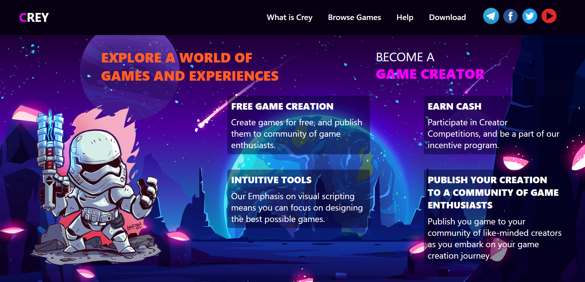
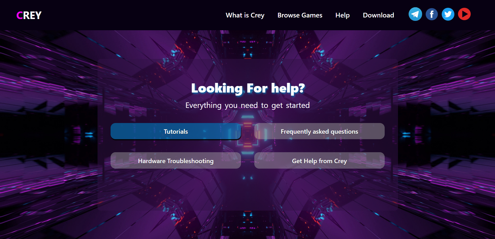
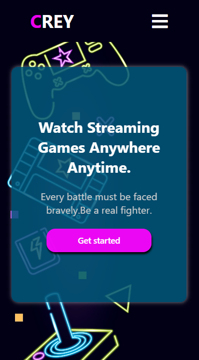
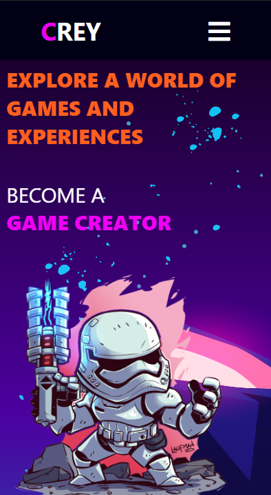
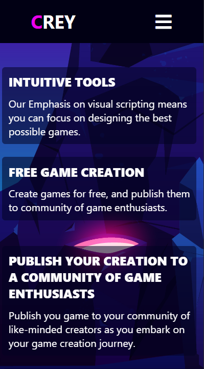
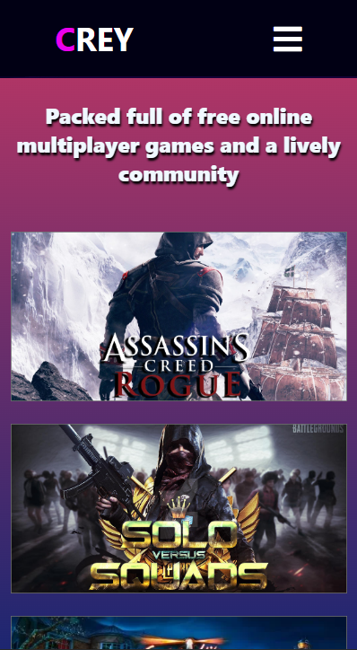
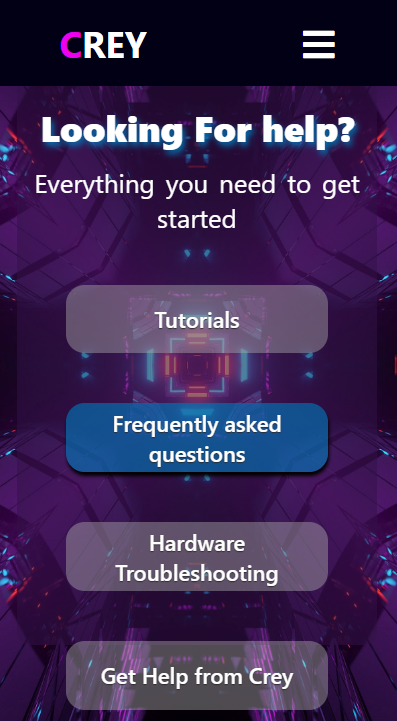
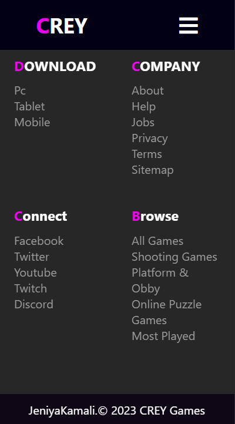

# Crey Gaming Website

This repository contains the source code for the Crey Gaming Website, a responsive web application built entirely in ReactJS, using HTML and CSS. The website is designed to showcase gaming content and features a responsive layout to ensure optimal viewing across various devices. It includes a range of gaming-related content and functionalities, providing an engaging user experience.

## Screeshot

### Mobile view:

## Key Features:
- Developed using ReactJS for a dynamic and interactive user interface.
- Utilizes HTML and CSS exclusively for styling and structure.
- Ensures responsiveness across multiple devices for an optimal user experience.
- Showcases gaming content and related features for an immersive browsing experience.

## Technologies Used:
- ReactJS
- HTML
- CSS

Feel free to explore and contribute to the development of this gaming website.
